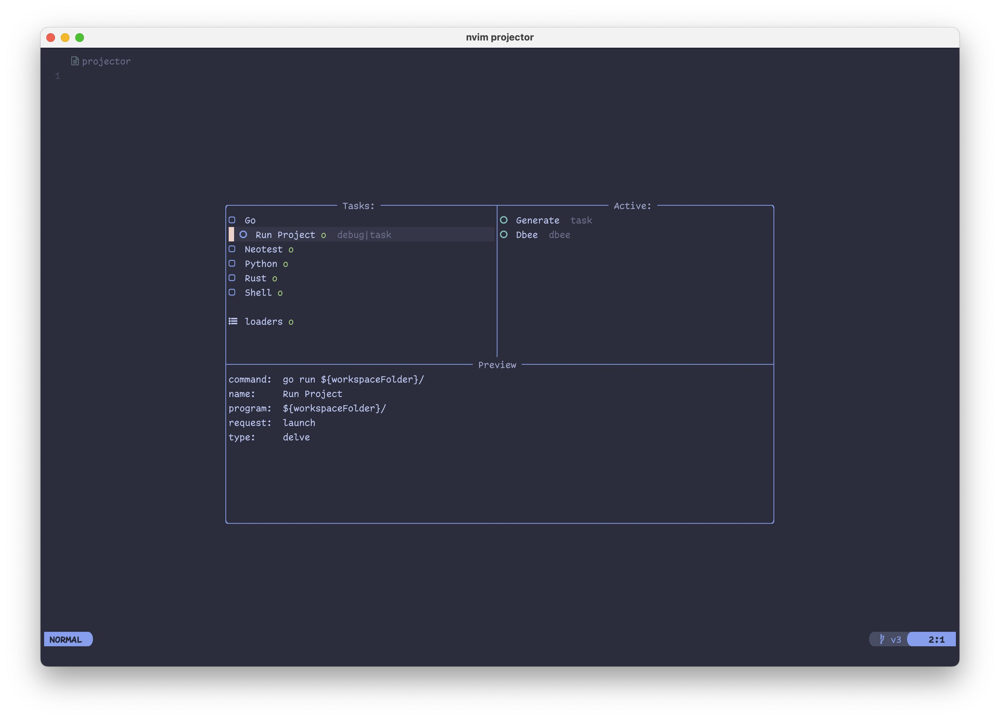

<!-- DOCGEN_IGNORE_START -->

<!-- This tag controlls what's ignored by the docgen workflow. -->


[](https://www.buymeacoffee.com/kndndrj)


<!-- DOCGEN_IGNORE_END -->

# Neovim Projector

Extensible code-runner/project-configurator.

**Manage Tasks, Databases, Tests and Debug Configurations in One Place!**

<!-- DOCGEN_IGNORE_START -->



<!-- DOCGEN_IGNORE_END -->

## Overview

Projector is a tool which manages configuration objects (lua key-value tables -
see [here](#configuration-object)), which have a different meaning depening on
the used output.

These configuration objects are loaded from different sources using `loaders`
(see [here](#loaders)), preprocessed by output builders and later used as
outputs.

For example, configuration object is loaded from `tasks.json` file, `task`
output builder preprocessor finds it compatible with it's output, so the task is
visible in the UI. When the user selects to run this task, it is sent to `task`
output.

Here approximately how this looks like:

```
    LOADERS                       OUTPUT BUILDERS

┌──────────────┐                        ┌──────────┐
│              │                        │          │
│ tasks.json   ├── 1 ────┐   ┌── has ───► task     ──┐
│              │ object  │   │ command? │          │ │
└──────────────┘         │   │          └──────────┘ │
                         │   │                       │
┌──────────────┐         │   │          ┌──────────┐ │
│              │         │   │          │          │ │
│ launch.json  ├── 3 ────┼───┼── can ──►│ debug    ──┼─► - ... (task)  
│              │ objects │   │  debug?  │          │ │   - ... (task|debug)
└──────────────┘         │   │          └──────────┘ │   - ... (database) ───► run
                         │   │                       │   - ... (task)           │
┌──────────────┐         │   │          ┌──────────┐ │                          │
│              │         │   │          │          │ │                          │
│ package.json ├── 2 ────┘   └── has ───► database ──┘                          ▼
│              │ objects     connection?│          │                     open dadbod ui
└──────────────┘                        └──────────┘
```

## Installation

### packer.nvim

<!-- DOCGEN_IGNORE_START -->

<details>
  <summary>Click to expand</summary>
<!-- DOCGEN_IGNORE_END -->

```lua
use {
  "kndndrj/nvim-projector",
  requires = {
    -- required:
    "MunifTanjim/nui.nvim",
    -- optional extensions:
    "kndndrj/projector-neotest",
    -- dependencies of extensions:
    "nvim-neotest/neotest",
  },
  config = function()
    require("projector").setup(--[[optional config]])
  end,
}
```

<!-- DOCGEN_IGNORE_START -->

</details>
<!-- DOCGEN_IGNORE_END -->

### lazy.nvim

<!-- DOCGEN_IGNORE_START -->

<details>
  <summary>Click to expand</summary>
<!-- DOCGEN_IGNORE_END -->

```lua
{
  "kndndrj/nvim-projector",
  dependencies = {
    -- required:
    "MunifTanjim/nui.nvim",
    -- optional extensions:
    "kndndrj/projector-neotest",
    -- dependencies of extensions:
    "nvim-neotest/neotest",
  },
  config = function()
    require("projector").setup(--[[optional config]])
  end,
},
```

<!-- DOCGEN_IGNORE_START -->

</details>
<!-- DOCGEN_IGNORE_END -->

## Setup

You can pass an optional table parameter to `setup()` function.

Here are the defaults:

<!--DOCGEN_CONFIG_START-->

<!-- Contents from lua/projector/config.lua are inserted between these tags for docgen. -->

[`config.lua`](lua/projector/config.lua)

<!--DOCGEN_CONFIG_END-->

## Usage

- Call the `setup()` function with an optional config parameter.

- Map these functions to keys of your choice:

  ```lua
  require"projector".continue()
  require"projector".toggle()
  require"projector".next()
  require"projector".previous()
  require"projector".restart()
  require"projector".kill()
  ```

- `continue` function is a direct replacement for `nvim-dap` and the main
  entrypoint to this plugin. So replace this:

  ```lua
  require"dap".continue()
  ```

  With this:

  ```lua
  require"projector".continue()
  ```

### Configuration Object

The configuration object is a base unit of projector and it is nothing more than
a simple hashmap.

A few fields have a special or `global` meaning (see snippet below), other than
that, the meaning of fields is determined by the `outputs`.

For example: `dadbod` output doesn't care about `command`, `port` or `env`
fields, but `dap` output does. This means that a configuration object with just
the forementioned fields can be ran in `dap` output mode, but not in `dadbod`
output mode (additional ref with `:h projector.ref.task`).

```lua
{
  -- These have special "global" meaning:
  id = "specific.task.id" -- ID is optional, but can be useful for specifying dependencies
  name = "Task", -- task's name
  dependencies = {  -- list of task ids to run before this one
    "setup.some.stuff",
    "setup.some.more.stuff"
  },
  after = "cleanup.task.id", -- task id to run after this one is finished
  evaluate = "task", -- run this config in "task" mode immedialtely after loading
  children = { -- nesting is also supported
    {
      name = "...",
      -- ... other config fields
    },
 }
}
```

### Loaders

Loaders provide configuration objects from various sources. You can control
which sources to use using the setup function:

```lua
require("projector").setup {
  loaders = {
    require("projector.loaders").BuiltinLoader:new()
    require("projector.loaders").DapLoader:new( ),
    -- ...
  },
}
```

There are a few loaders that are built-in:

- `BuiltinLoader` - loads configs from
  [`projector.json`](examples/projector.json). The tasks can also be specifies
  in lua config.
- `DapLoader` - loads `dap.configurations`

If you want to create your own loader, implement the Loader interface
(`:h projector.ref.loaders`).

### Outputs and Output Builders

Outputs are modules that recieve a configuration object and run it's commands
(show the output on screen). Output Builders on the other hand provide a means
to build those outputs. As a user, you only need to care about providing output
builders in the config:

```lua
require("projector").setup {
  outputs = {
    require("projector.outputs").TaskOutputBuilder:new(),
    require("projector.outputs").DadbodOutputBuilder:new(),
    require("projector.outputs").DapOutputBuilder:new(),
  },
}
```

You can pick form a few built-ins...

- `TaskOutputBuilder` builds a terminal output, which runs a shell command
- `DapOutputBuilder` builds an output which runs `nvim-dap`
- `DadbodOutputBuilder` picks `database` and `query` fields from all loaded
  configs and provieds a single task that opens `vim-dadbod-ui`

Or you can choose to implement your own (`:h projector.ref.outputs`)

### Extensions

Here is a list of available extensions, which provide different outputs and
loaders:

- [neotest](https://github.com/kndndrj/projector-neotest) output.
- [vscode](https://github.com/kndndrj/projector-vscode) `launch.json` and
  `tasks.json` loaders.
- [intellij](https://github.com/kndndrj/projector-idea) `.idea` workspace folder
  loader.
- [dbee](https://github.com/kndndrj/projector-dbee) - provides a `DadbodOutput`
  replacement.
